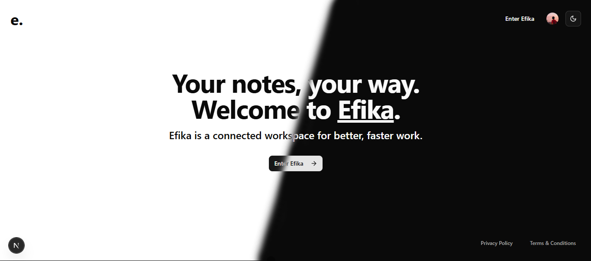

# Efika - A Full-Stack Notion Clone



A feature-rich Notion clone built with modern web technologies, offering a seamless note-taking and document management experience.

## ✨ Features

### 🎯 Core Features
- 📝 **Notion-style Editor**: Rich text editing with BlockNote
- 🔗 **Real-time Database**: Powered by Convex for instant updates
- 🌓 **Light and Dark Mode**: Seamless theme switching
- 🌲 **Infinite Nested Documents**: Create unlimited document hierarchies
- 🗑️ **Trash System**: Soft delete with recovery options
- 🔐 **Authentication**: Secure user management
- 🖼️ **Document Management**:
  - Cover images
  - Custom icons
  - File upload/deletion/replacement
  - Document publishing to web

### 🎨 UI/UX Features
- ➡️ **Expandable Sidebar**: Collapsible navigation
- 📱 **Mobile Responsive**: Optimized for all devices
- 🛬 **Landing Page**: A simple project introduction
- 🔄 **Document Recovery**: Restore deleted files

### 🚧 Coming Soon
- 📊 **Flowchart Integration**: Miro-like diagram creation and collaboration
- 🔗 **Document Linking**: Create connections between documents
- More features in development...

## 🛠️ Tech Stack

### 💻 Frontend
- **Next.js 14**: React framework with App Router
- **TypeScript**: Type-safe development
- **BlockNote**: Rich text editor
- **shadcn/ui**: Beautiful UI components
- **Tailwind CSS**: Utility-first styling

### ⚙️ Backend
- **Convex**: Real-time database and backend
- **EdgeStore**: File storage and management

### 🔐 Authentication
- **Clerk**: User authentication and management

## 🚀 Getting Started

1. Clone the repository
2. Install dependencies:
   ```bash
   npm install
   ```
3. Set up environment variables:
   ```env
   CONVEX_DEPLOYMENT
   NEXT_PUBLIC_CONVEX_URL
   VITE_CLERK_FRONTEND_API_URL
   NEXT_PUBLIC_CLERK_PUBLISHABLE_KEY
   CLERK_SECRET_KEY
   EDGE_STORE_ACCESS_KEY
   EDGE_STORE_SECRET_KEY
   ```
4. Run the development server:
   ```bash
   npm run dev
   ```

5. Run the Convex backend:
   ```bash
   npx convex dev
   ```

## 📁 Project Structure

```
efika/
├── src/
│   ├── app/                 # Next.js app directory
│   ├── components/         # React components
│   ├── hooks/             # Custom React hooks
│   └── lib/               # Utility functions
├── convex/                # Convex backend
└── public/               # Static assets
```

> **Note**: This project is currently in development and not yet deployed. I will add deployment instructions and live demo soon.

## 🔄 Development Roadmap

I am still developing this project and will some mpre features as I go.
- Flowchart integration
- Document linking
- Enhanced collaboration features
- And hopefully more...

---

Built with ❤️ using modern web technologies

